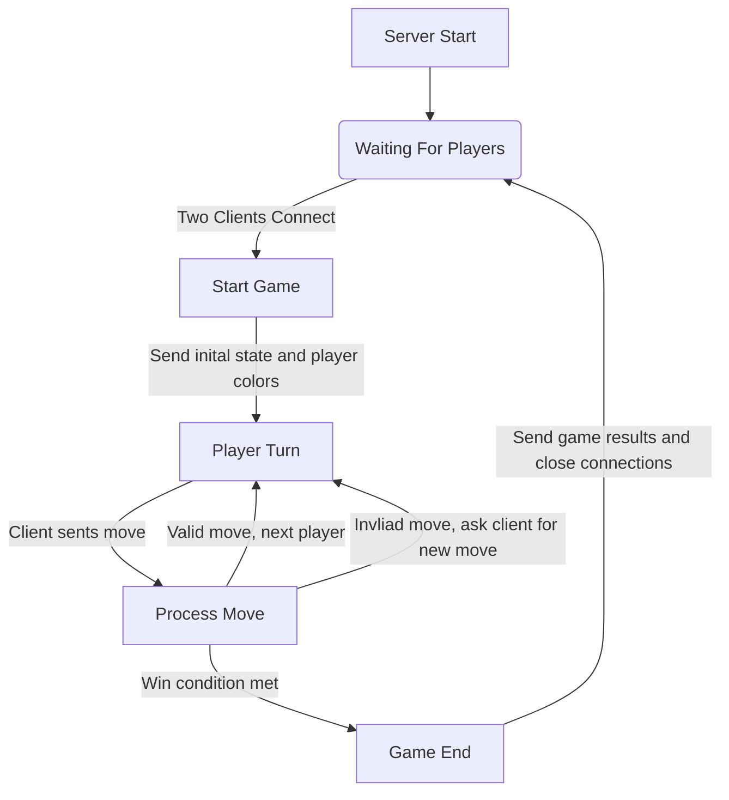

```mermaid
flowchart TD
    A[Server Start] --> B(Waiting For Players)
    B --> |Two Clients Connect| C[Start Game]
    C -->|Send inital state and player colors| D[Player Turn]
    D --> |Client sents move| E[Process Move]
    E --> |Valid move, next player| D
    E --> |Invliad move, ask client for new move| D
    E --> |Win condition met| F[Game End]
    F --> |Send game results and close connections| B
```