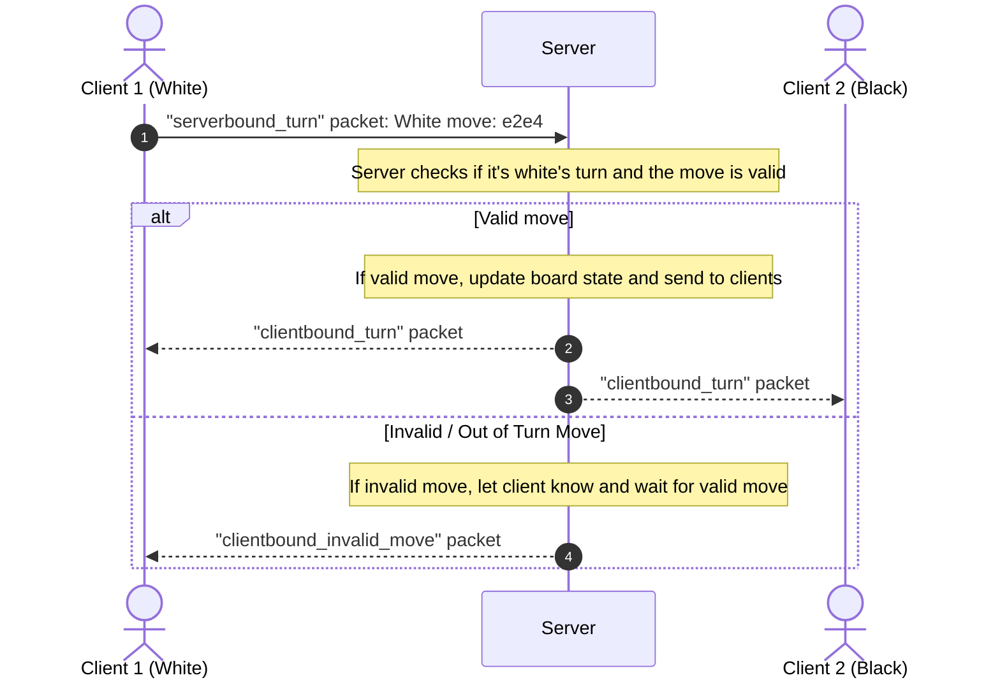

```mermaid
sequenceDiagram
    autonumber
    actor w as Client 1 (White)
    participant s as Server
    actor b as Client 2 (Black)
    
    w ->> s: "serverbound_turn" packet: White move: e2e4
    Note over s: Server checks if it's white's turn and the move is valid
    
    alt Valid move
        Note over s: If valid move, update board state and send to clients
        s-->>w: "clientbound_turn" packet
        s-->>b: "clientbound_turn" packet
        
    else Invalid / Out of Turn Move
    Note over s: If invalid move, let client know and wait for valid move
        s-->>w: "clientbound_invalid_move" packet
    end
    
```